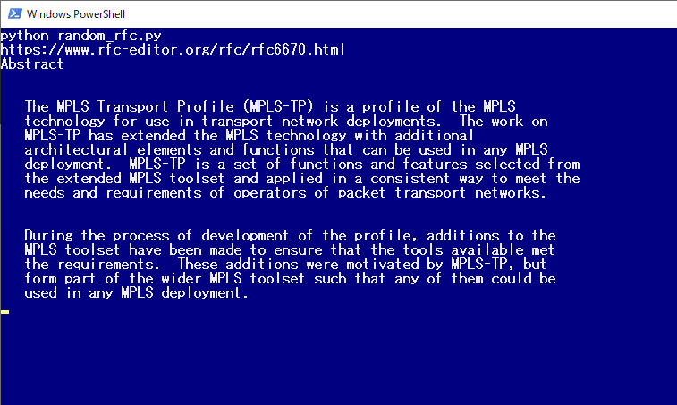

# random_abstract_RFC
Random scraping of RFC. And extract abstracts.

RFC から英語学習用の例文をスクレイピングする CLI ツール。

    $ python random_rfc.py

## Q&A
    - プログラムが想定通りに動かない。
        - buffer 数より残り行数が少ないとき
        - Abstract より先に "Abstract" という単語がでたとき
